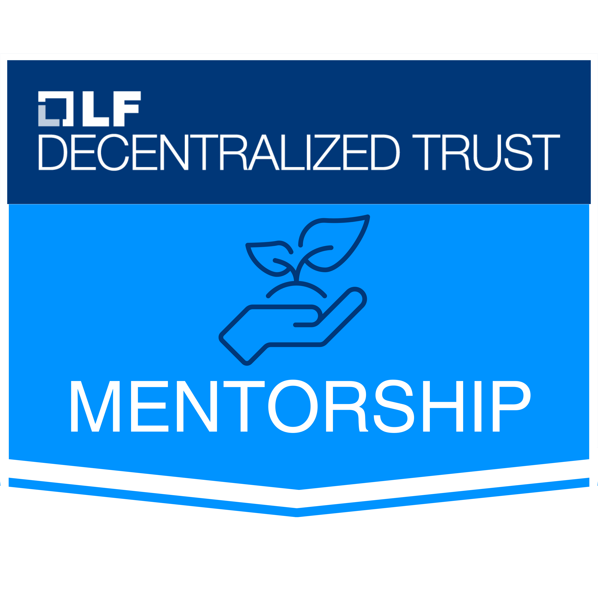

# LF Decentralized Trust Mentorship Program

  

The [LF Decentralized Trust Mentorship Program](https://lf-decentralized-trust-mentorships.github.io/mentorship-program/main/) provides a structured remote learning opportunity for aspiring decentralized tech developers, researchers, and other contributors. 

LF Decentralized Trust project maintainers, experienced developers, and active community members will mentor participants, guiding them to complete a mentorship project with a defined scope and outcome. 

Mentors and mentees will collaborate remotely from their preferred locations, with regular evaluations and feedback provided. Mentees will have the opportunity to showcase their learnings and contributions through blogging, speaking at meetups or regional events, or traveling to a global event to present their work in person and network with the broader community. 

The mentorship program plays an important role in introducing new talent to the LF Decentralized Trust projects and community, which contributes to maintaining and enhancing the health and sustainability of our open source community.
